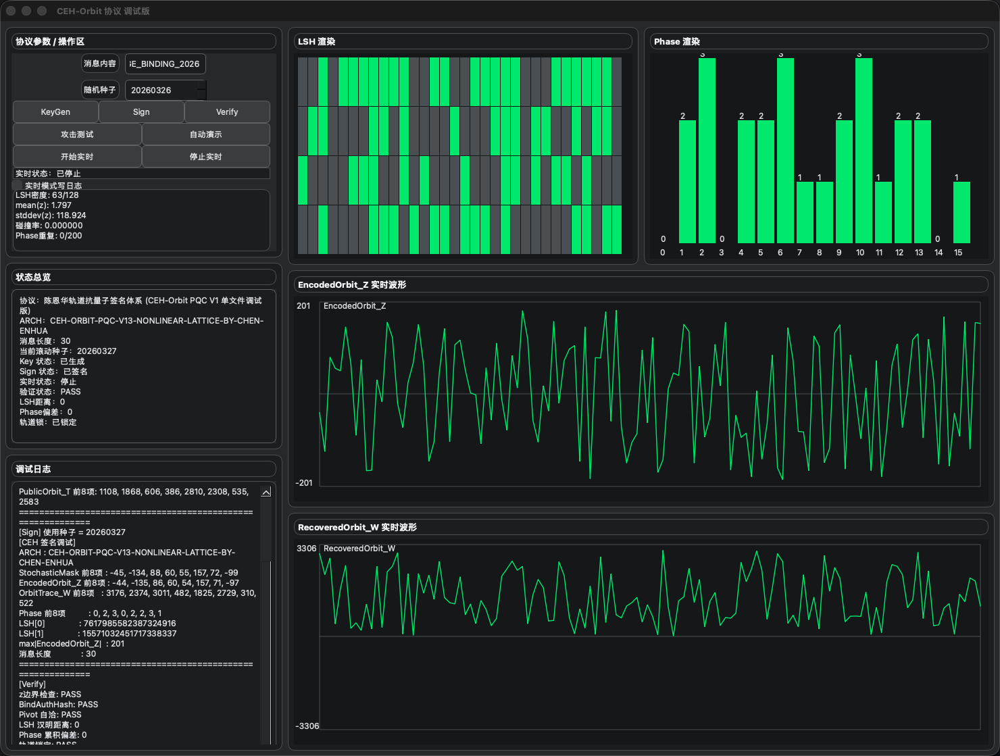

<!--
keywords:
post quantum cryptography
digital signature
lattice signature
LSH signature
orbit cryptography
experimental cryptography
lightweight signature
qt visualization crypto
-->

# CEH-Orbit

> Traditional digital signatures verify “whether the computation is correct”,  
> **CEH-Orbit verifies “whether the trajectory (orbit) is correct”.**

---

## ⚡ Core Idea (One Line)

> CEH-Orbit = Algebra Verification + Orbit Consistency

---

## ⚔️ Key Differences

| Traditional Signatures (Dilithium / Falcon) | CEH-Orbit |
|-------------------------------------------|----------|
| Algebraic equality verification | Algebra + Orbit structure verification |
| Requires exact equality | Extendable to tolerance-based orbit |
| Not interpretable | Visualizable (LSH / Phase / Waveform) |
| No structural compression | OrbitHead (128-bit + Phase) |

---

## 🔬 Experimental Results (Current Version)

### Performance
| Metric | CEH-Orbit |
|--------|----------|
| Signing Time | ~0.35 ms |
| Verification Time | ~0.28 ms |
| Signature Size | ~624 Bytes |

---

### Security (Empirical)

| Test | Result |
|------|--------|
| Random Attack | 0 / 10000 success |
| Head Collision | 0 / 100000 |
| Challenge Collision | Not observed |

---

### 🌊 Orbit Sensitivity (Key Finding)

| Perturbation | PASS Rate |
|-------------|----------|
| ±1 | 100% |
| ±5 | 100% |
| ±9 | 100% |
| ±10 | 0% |

👉 Shows a clear **non-linear acceptance basin**

---

## 🧠 Intuition

> Traditional signature: “compute correctly”  
> CEH-Orbit: “follow the correct trajectory”

---



---

## 🚀 Project Overview

CEH-Orbit is a research-oriented post-quantum authentication / signature project  
built around **Orbit Mapping**.

It provides:

- Protocol prototype  
- Qt visualization tool  
- Technical specification  
- Whitepaper  
- Paper draft  
- License & disclaimer  

This project does NOT aim to replace existing PQC standards,  
but to establish a **runnable, observable, debuggable research baseline**  
for a new direction: **Orbit Cryptography**.

---

## 1. Project Positioning

CEH-Orbit is:

- A research prototype  
- A geometric verification exploration  
- A Qt visualization platform  
- A Spec / Whitepaper / Paper combined project  

Key ideas:

- Goes beyond strict algebra equality  
- Introduces `OrbitHead`  
- Uses `LSH + Phase` compression  
- Uses Fiat-Shamir style challenge  
- Includes attack / collision / stability testing  

---

## 2. Core Concept

Traditional lattice signatures focus on:

- Algebra closure  
- Hardness reduction  
- Tight error control  

CEH-Orbit explores:

> Mapping high-dimensional algebra into low-dimensional orbit descriptors,  
> then verifying consistency in orbit space.

Core components:

- OrbitTrace_W  
- OrbitHead  
- LSH  
- Phase  
- GeometricPivot  
- EncodedOrbit_Z  
- RecoveredOrbit_W  

Enables:

- Visualization  
- Dynamic behavior  
- Sensitivity testing  
- Acceptance basin study  

---

## 3. Project Contents

### Engineering
- Qt demo (single / multi file)  
- CMake build  
- OpenSSL hashing  

### Documents
- Whitepaper  
- Paper  
- Spec  
- USAGE  
- Disclaimer  
- Third-party notes  

### Experiments
- Sign / Verify loop  
- Attack simulation  
- Perturbation test  
- Collision test  
- Phase stability  
- Visualization  

---

## 4. Structure

```text
Demo/
├── assets/
├── docs/
│   ├── CEH-Orbit_Paper.md
│   ├── CEH-Orbit_Spec_V1.md
│   ├── CEH-Orbit_Whitepaper_V1.md
│   ├── DISCLAIMER.md
│   ├── THIRD_PARTY_NOTICES.md
│   └── USAGE.md
├── CMakeLists.txt
├── main.cpp
├── README.md
├── LICENSE.md
└── resources.qrc
```

---

## 5. Quick Start

### Build

```bash
mkdir -p build
cd build
cmake ..
cmake --build . -j
```

### Run

```bash
./CEH_Orbit
```

---

## 6. UI Overview

Left:
- Parameters  
- Controls  
- Logs  

Right:
- LSH grid  
- Phase chart  
- Z waveform  
- W waveform  

---

## 7. Workflow

```text
KeyGen → Sign → Verify → Attack → Real-time
```

---

## 8. Expected Results

- Verify = PASS  
- LSH = 0  
- Phase = 0  
- Orbit lock = PASS  

---

## 9. Scope

### This IS
- Research prototype  
- Visualization tool  
- Experimental system  

### This IS NOT
- Production crypto  
- Proven secure system  
- Side-channel safe  

---

## 10. Completed

- Message binding  
- OrbitHead  
- Geometry check  
- Attack tests  
- Visualization  

---

## 11. Future Work

- Security reduction  
- Higher dimensions  
- Noise model  
- τ tolerance  
- NTT optimization  
- Hardware  

---

## 12. Reading Order

README → USAGE → Spec → Whitepaper → Paper

---

## 13. Usage

- Developers → Spec  
- Demo → Qt  
- Research → Full docs  

---

## 14. License

- Free for research  
- Commercial use requires authorization  

---

## 15. Contact

Author: Chen Enhua  
Email: a106079595@qq.com  
